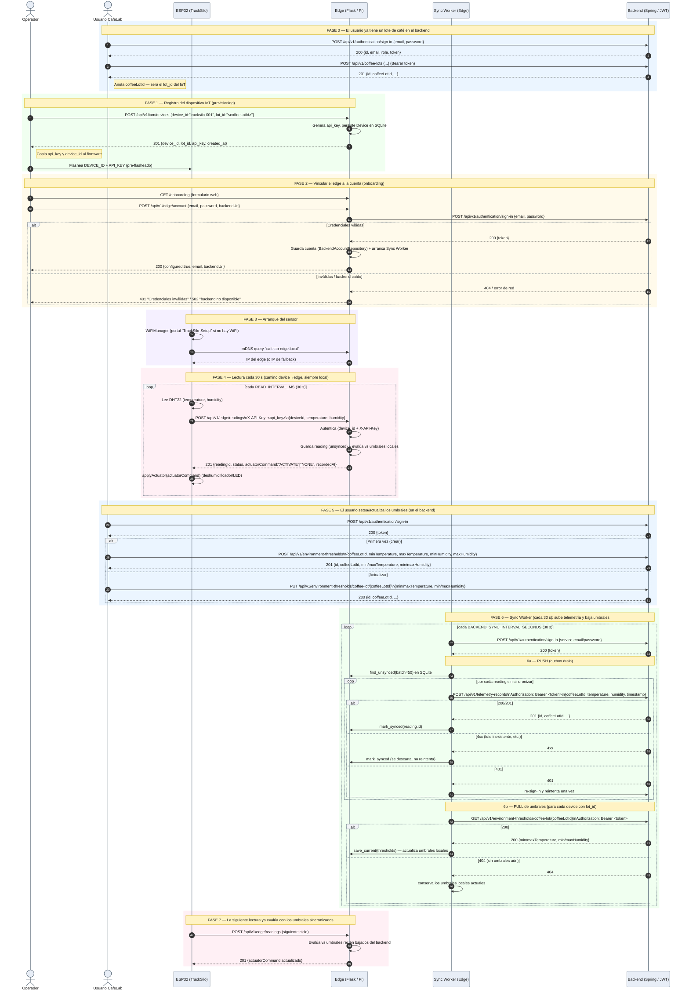

# Diagrama de secuencia — CafeLab IoT (registro → umbrales → telemetría)

Cubre el ciclo de vida completo: registro del dispositivo IoT en el edge,
vinculación del edge a la cuenta del backend, configuración de umbrales por el
usuario, envío de lecturas (device → edge, local e instantáneo) y la
sincronización en segundo plano (edge ↔ backend) que sube telemetría y baja
umbrales.

## Participantes

| Participante | Qué es | Repo |
|---|---|---|
| **Operador** | Persona que provisiona el hardware y vincula la cuenta | — |
| **Usuario CafeLab** | Dueño del lote; configura umbrales desde la app/web | — |
| **ESP32** | Firmware TrackSilo (DHT22 + actuador) | `edge-clean/firmware/tracksilo-esp32` |
| **Edge** | Servicio Flask en la Raspberry Pi (SQLite local) | `edge-clean` |
| **Sync Worker** | Hilo daemon dentro del Edge (cada 30 s) | `edge-clean/shared/infrastructure/sync_worker.py` |
| **Backend** | API Spring Boot CafeLab (JWT) | `cafeLab-backEnd` |

> Nota de vínculo de datos: en el Edge el dispositivo se registra con un
> `lot_id`. Ese `lot_id` **es** el `coffeeLotId` del backend (debe ser
> numérico); así el Edge sabe a qué lote subir telemetría y de qué lote bajar
> umbrales (`_coffee_lot_id_for` en `sync_services.py`).

---

## Diagrama

---

## Endpoints involucrados (resumen)

### En el Edge (Flask)
| Método | Ruta | Auth | Quién la usa | Body / Respuesta |
|---|---|---|---|---|
| POST | `/api/v1/iam/devices` | — | Operador | `{device_id, lot_id}` → `201 {api_key,...}` |
| POST | `/api/v1/iam/authentication` | X-API-Key | (diagnóstico) | `{device_id}` |
| GET | `/onboarding` | — | Operador | HTML |
| GET/POST | `/api/v1/edge/account` | — | Operador | `{email, password, backendUrl}` |
| POST | `/api/v1/edge/readings` | X-API-Key | ESP32 | `{deviceId, temperature, humidity}` → `201 {status, actuatorCommand}` |
| GET | `/api/v1/edge/thresholds` | — | dashboard | umbrales actuales locales |
| PUT | `/api/v1/edge/thresholds` | X-API-Key | (override local) | `{minTemperature,...}` |
| POST | `/api/v1/edge/sync` | X-API-Key | trigger manual | fuerza push+pull |

### En el Backend (Spring, JWT Bearer)
| Método | Ruta | Quién la usa | Body / Respuesta |
|---|---|---|---|
| POST | `/api/v1/authentication/sign-in` | Usuario + Sync Worker | `{email, password}` → `{token}` |
| POST | `/api/v1/coffee-lots` | Usuario | crea el lote → `coffeeLotId` |
| POST | `/api/v1/environment-thresholds` | Usuario | `{coffeeLotId, min/maxTemperature, min/maxHumidity}` |
| PUT | `/api/v1/environment-thresholds/coffee-lot/{coffeeLotId}` | Usuario | actualiza umbrales |
| GET | `/api/v1/environment-thresholds/coffee-lot/{coffeeLotId}` | Sync Worker | baja umbrales |
| POST | `/api/v1/telemetry-records` | Sync Worker | `{coffeeLotId, temperature, humidity, timestamp}` |
| GET | `/api/v1/telemetry-records/coffee-lot/{coffeeLotId}` | Usuario/dashboard | historial |

## Notas de diseño clave
- **Dos caminos desacoplados**: el camino *device → edge* (lecturas) es siempre
  local e instantáneo contra SQLite; el camino *edge → backend* es eventual y
  lo maneja el Sync Worker. El ESP32 nunca habla con el backend.
- **`timestamp`** se manda al backend como `LocalDateTime` (UTC sin offset, sin
  `Z`) porque Jackson lo mapea a `java.time.LocalDateTime`
  (`backend_client._to_backend_timestamp`).
- **Reintentos**: en push, un 4xx marca la fila como sincronizada (no se
  reintenta); un 5xx/red corta el lote y se reintenta el siguiente ciclo. En
  cualquier request, un 401 dispara un re-sign-in y un reintento.
- **Vínculo lot_id ↔ coffeeLotId**: si el `lot_id` del device no es numérico o
  es nulo, el Edge no puede mapearlo y omite ese device en la sincronización.
